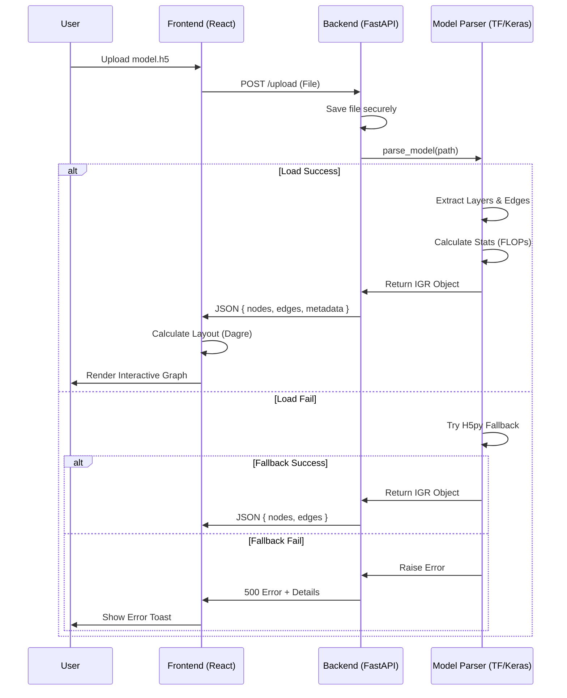

# High-Level Architecture Design

## 1. System Overview
The system follows a **Client-Server Architecture**.
- **The Client (Frontend)** is a React Single Page Application (SPA) responsible for rendering the interactive graph and handling user input.
- **The Server (Backend)** is a FastAPI Python service responsible for robust model parsing, safety checks, and graph data extraction.

## 2. Component Architecture

### A. Frontend (React + Vite)
*Responsibilities:*
- **Model Upload Manager**: Handles drag-and-drop credentials and file streaming.
- **Visual Engine**: Uses **React Flow** to render the Node-Edge graph.
- **Inspector Panel**: A side panel displaying detailed JSON config and stats for selected layers.
- **State Management**: Manages graph layout state and UI loading states.

### B. Backend (FastAPI + TensorFlow)
*Responsibilities:*
- **Upload Controller**: Receives binary file streams and saves them to a temporary secure sandbox.
- **Safety Layer**: Validates file types and prevents execution of malicious lambda layers during loading.
- **Parser Engine**:
    - **Loader Strategies**: Tries multiple loading methods (Standard, Config-only, H5py-direct) to maximize compatibility.
    - **Graph Extractor**: Iterates over Keras internal `_inbound_nodes` to reconstruct the Directed Acyclic Graph (DAG).
    - **Analyzer**: Computes FLOPs and parameter percentages.
- **Response Formatter**: Converts internal graph structures into the standardized **Intermediate Graph Representation (IGR)** JSON.

### C. Data Flow
1. **User Action**: Drags `.h5` file to UI.
2. **Frontend**: PUTs file to `/upload` endpoint.
3. **Backend**:
    a. Saves file to `/tmp/sandbox/`.
    b. **Parser Engine** attempts load.
    c. **Extractor** traverses layers -> builds IGR.
    d. Returns `IG_JSON` response.
    e. Deletes temp file.
4. **Frontend**:
    a. Receives `IG_JSON`.
    b. **Layout Engine** (Dagre) calculates x,y coordinates.
    c. **Visual Engine** renders Interactive Graph.

## 3. Technology Stack Justification
- **FastAPI**: High performance, native async support for file I/O, auto-generation of API docs.
- **TensorFlow/Keras**: Native library required to parse `.h5` files correctly. `h5py` is used as a fallback for robustness.
- **React Flow**: The industry standard for node-based editors in React. Handles zoom/pan/drag interactions efficiently.
- **Vite**: Modern build tool, significantly faster than Create React App.
- **Tailwind CSS**: Utility-first styling for a premium, consistent "Dark Mode" aesthetic.

## 4. Component Interaction Diagram

